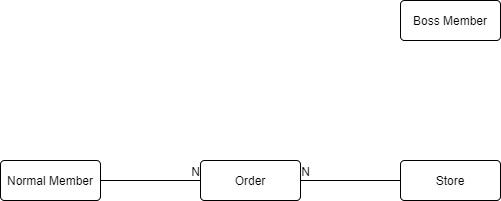
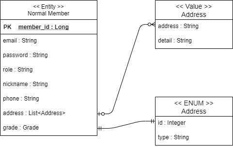
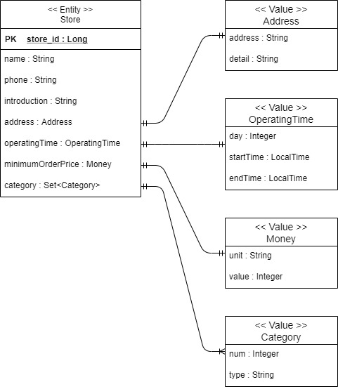
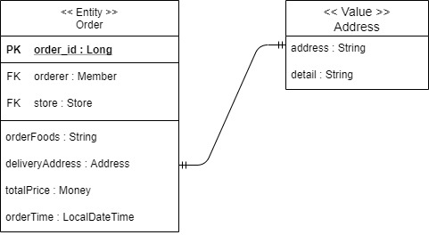

# 개요

배달의 민족과 같이 사용자가 가게에서 음식을 주문할 수 있는 서비스를 구현하고자 합니다.

토이 프로젝트에서 사용할 프레임워크 목록은 아래와 같습니다.

- Spring Boot
- Spring Security + Json Web Token
- JPA
- Lombok
- h2

배달의 민족 비즈니스를 모두 구현하기에는 무리가 있기 때문에, 단순한 비즈니스 로직을 우선적으로 구현하고 점차 넓혀가는 방식으로 구현을 할 예정입니다.

우선적으로, 사용자가 가게에서 음식을 주문하는 비즈니스 로직만 구현하도록 합니다.

# 도메인

## 기본 도메인 설계

- Member (일반 회원)
    - 가게에서 음식을 주문하는 일반 회원입니다.
- Boss (사장 회원)
    - 소유한 가게를 등록하고 관리할 수 있는 사장 회원입니다.
- Store (가게)
    - 사장 회원이 소유할 수 있는 다양한 음식을 가진 가게입니다.
- Order (주문)
    - 일반 회원은 가게에서 음식을 주문할 수 있습니다.

> 현재는 일반 회원 도메인의 기능을 수행할 애플리케이션을 개발할 것이기 때문에 사장 회원 도메인의 기능은 별도 애플리케이션으로 개발하도록 합니다. 추후에 Store와 Order 도메인 애플리케이션도 분리하여 MSA를 지향하도록 합니다.

### Entity Relation

위의 도메인을 가지고 관계도를 그려보면 아래와 같은 도메인을 만들 수 있습니다.

## 상세 도메인 설계

각 도메인에 대한 상세적인 부분을 설계합니다.

### Member

### Store

### Order

# 패키지 구조

> https://cheese10yun.github.io/spring-guide-directory/ 를 참고하여 도메인 형으로 패키지 구성

- src.main.java.com.gokoy.delivery
    - domain
        - member
            - api
            - application
            - dao
            - domain
            - dto
            - exception
        - store
        - order
    - global
        - common
            - request
            - response
        - config
            - security
            - swagger
        - error
            - exception
        - util

# 인증, 인가

[Spring Security](./src/main/java/com/gokoy/delivery/global/config/security/README.md)

# 예외 처리

[Exception Handling](./src/main/java/com/gokoy/delivery/global/error/README.md)

# Swagger 설정

[Swagger Setting](./src/main/java/com/gokoy/delivery/global/config/swagger/README.md)

---

# 도메인 로직 구현

## Member 도메인 로직 구현

### 

- 회원 가입
- 로그인
- 회원 정보 조회
- 회원 정보 수정
- 회원 탈퇴
- 
