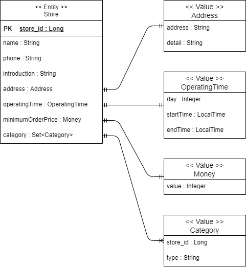

# 개요

배달의 민족과 같이 사용자가 가게에서 음식을 주문할 수 있는 서비스를 구현하고자 합니다.

토이 프로젝트에서 사용할 프레임워크 목록은 아래와 같습니다.

- Spring Boot
- Spring Security + Json Web Token
- JPA
- Lombok
- h2

배달의 민족 비즈니스를 모두 구현하기에는 무리가 있기 때문에, 단순한 비즈니스 로직을 우선적으로 구현하고 점차 넓혀가는 방식으로 구현을 할 예정입니다.

우선적으로, 사용자가 가게에서 음식을 주문하는 비즈니스 로직만 구현하도록 합니다.

---

# 도메인

## 기본 도메인 설계

- Member (일반 회원)
    - 가게에서 음식을 주문하는 일반 회원입니다.
- Boss (사장 회원)
    - 소유한 가게를 등록하고 관리할 수 있는 사장 회원입니다.
- Store (가게)
    - 사장 회원이 소유할 수 있는 다양한 음식을 가진 가게입니다.
- Order (주문)
    - 일반 회원은 가게에서 음식을 주문할 수 있습니다.

> 현재는 Member(일반 회원) 도메인의 기능을 수행할 애플리케이션을 개발할 것이기 때문에 Boss(사장 회원) 도메인의 기능은 별도 애플리케이션으로 개발하도록 합니다. 
> 추후에 Store와 Order 도메인 애플리케이션도 분리하여 MSA로 발전시키도록 합니다.

### Entity Relation

위의 도메인을 가지고 관계도를 그려보면 아래와 같은 도메인을 만들 수 있습니다.

## 상세 도메인 설계

각 도메인에 대한 상세적인 부분을 설계합니다.

### Member

### Store

### Order

## 메뉴 관련 도메인 추가
배달의 민족 어플을 보면 가게의 메뉴는 다음과 같은 구성으로 되어 있습니다.
- 메뉴 그룹
- 메뉴
- 옵션 그룹
- 옵션

**메뉴 그룹**은 각각의 메뉴를 성격에 따라 분류하여 묶어둔 그룹입니다. 메뉴를 추가하려면 메뉴 그룹을 생성하고 메뉴 그룹 내에서 메뉴 추가를 
할 수 있습니다.

**옵션 그룹**은 특정 메뉴에 대한 추가 옵션들이 담겨져 있는 그룹입니다. 옵션은 메뉴와 동일하게 옵션 그룹 내에서 추가할 수 있고, 옵션 그룹은 
다양한 메뉴에 추가할 수 있습니다.

메뉴 관련 도메인을 도식화하면 아래와 같이 나타낼 수 있습니다.

메뉴와 옵션 관련된 도메인들은 추가, 변경, 삭제에 대한 요구가 발생하기 때문에 Entity로 구현합니다.

그리고 Menu와 Option Group은 M:N의 관계를 가지고 있기 때문에 사이에 MenuOptionGroup 이라는 Entity를 별도로 두어,
1:N, N:1의 관계로 나누어 구현합니다.

이 부분을 기존 도메인에 추가하게 되면, 전체적인 도메인 관계도는 아래와 같이 변경됩니다.

---

# 패키지 구조

> https://cheese10yun.github.io/spring-guide-directory/ 를 참고하여 도메인 형으로 패키지 구성

- src.main.java.com.gokoy.delivery
    - domain
        - member
            - api
            - application
            - dao
            - domain
            - dto
            - exception
        - store
        - order
    - global
        - common
            - request
            - response
        - config
            - security
            - swagger
        - error
            - exception
        - util
---

# 인증, 인가

[Spring Security](./src/main/java/com/gokoy/delivery/global/config/security/README.md)

# 예외 처리

[Exception Handling](./src/main/java/com/gokoy/delivery/global/error/README.md)

# Swagger 설정

[Swagger Setting](./src/main/java/com/gokoy/delivery/global/config/swagger/README.md)

---

# API 개발

## Store

### 가게 등록

가게와 메뉴, 옵션등을 등록하는 API는 Boss(사장 유저)의 기능이기 때문에, 현재 애플리케이션에서는 없는 요구사항이지만 테스트를 위해서 개발

[POST] /stores

